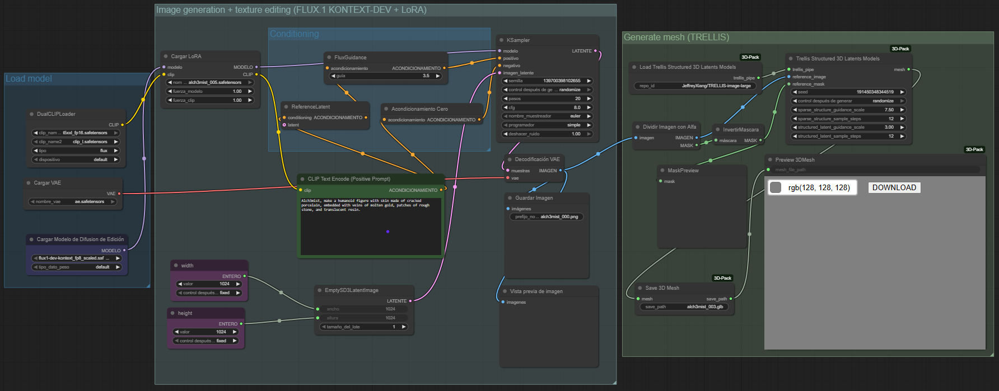

# material-alch3mist
An end-to-end text-to-mesh **FLUX.1 Kontext [dev]**-based diffusion model specialized on texture generation.

<p align="center">
  
</p>

> [!IMPORTANT]  
> This project has been developed for the [Black Forest Labs - FLUX.1 Kontext [dev] Hackathon](https://bfl-kontext-dev.devpost.com/?ref_feature=challenge&ref_medium=your-open-hackathons&ref_content=Submissions+open&_gl=1*1yagg28*_ga*MTUwNjg3MTQwMi4xNzU4MjcwMzY2*_ga_0YHJK3Y10M*czE3NTgyNzAzNjYkbzEkZzAkdDE3NTgyNzAzNjYkajYwJGwwJGgw).

## Flowchart / pipeline

<p align="center">
  
</p>

## Video presentation

Video submission for the Black Forest Labs - FLUX Kontext [dev] Hackathon ([full video in **Youtube**](https://www.youtube.com/watch?v=hYm-ZqHkuTE&feature=youtu.be)):

https://github.com/user-attachments/assets/eb0234f7-bef0-4466-9d07-2422ee12f0a4

# Introduction

The **Material-Alch3mist** project arises from the need to create 3D assets rich in textures from textual descriptions, combining innovation in generative models with modular flexibility. It is an **end-to-end text-to-mesh pipeline** based on **FLUX.1 Kontext \[dev]**, specialized in generating and enhancing textures, ensuring that the final 3D meshes retain fine details and stylistically coherent materials.

The core idea of the project is based on a **modular three-stage approach**. First, base images are generated from textual prompts using [**FLUX.1 [dev]**](https://github.com/black-forest-labs/flux), producing 2D assets that are coherent with the desired scene or object. The second stage introduces a specialized [**FLUX.1-Kontext [dev]**](https://fluxcontext.org/) dev for texture enhancement, trained with a **lightweight LoRA** that transforms these base images into enriched versions, applying specific materials, styles, and colors. Finally, the third stage converts these textured images into **multiview 3D meshes** using [**TRELLIS**](https://trellis3d.github.io), ensuring that texture fidelity is preserved when transitioning from 2D to 3D.

One of the main advantages of this approach is its **flexibility and modularity**. Each stage of the pipeline can be adjusted independently: different LoRAs or FLUX variants can be incorporated, the generative flow can be finely parameterized, and new textures can be experimented with without compromising the base model. Additionally, delegating texture enhancement to a LoRA enables **fast training**, requiring only a few hours of computation and a relatively small number of image pairs, avoiding the need to retrain full models with large datasets.

The project also integrates a **testing and visualization environment**, including a repository with ComfyUI JSON configurations, ChatGPT prompts for generating texture and material variations, and a workflow that allows producing images, transforming them, and generating the final 3D mesh with ease. Optionally, a **web interface based on OWUI** is planned, where users can submit prompts, visualize results, and explore multiviews of their generated assets.

Overall, **Material-Alch3mist** represents an innovative approach to text-to-mesh generation, combining diffusion techniques, LoRA, and modular pipelines to provide an accessible, efficient, and highly customizable 3D creation experience, ideal for artistic exploration and practical applications in design and simulation environments.

# Models

Essentially, in this project we use three different models. Each serves a specific purpose and was motivated by the need to address challenges that arose during the development of the main idea driving this project: the generation of realistic and visually striking 3D objects from text.

## FLUX.1 [dev]

This model consists of a large-scale multimodal UNet designed for high-quality and fast text-to-image generation.

We have used it for creating the initial 2D images from text prompts, which serve as the foundational visual reference to further optimize our model.

We have employed a basic workflow, available [here](https://github.com/alejandro-garnung-ctic/material-alch3mist/blob/main/flows/flux-dev-basic.json), which encapsulates its main functionalities.

## FLUX.1-Kontext [dev]

This model consists of a specialized version of FLUX.1 fine-tuned to generate single-view texture-enhanced consistent images from a single text prompt and a original baseline image.

We have used it for producing enhanced images, optimized for a further reliable mesh generation, highlighting quality texture, material, colors and prompt coherence, which are essential for accurate 2D and 3D generation.

We have employed a basic workflow, available [here](https://github.com/alejandro-garnung-ctic/material-alch3mist/blob/main/flows/flux-kontext-dev-basic.json), which encapsulates its main functionalities.

The training of the LoRA adapter, aimed at specializing the model in the precise generation of textures and materials, was carried out using the trigger word /Alch3mist/, employing blank images and dynamic (usual, non-static) prompts both during testing and normal operation (inference), with the control dataset consisting of the `/baseline_images` images from the `/data` folder, generated by the FLUX.1 [dev] baseline, along with their respective dynamic prompts.

## TRELLIS

This model consists of TRELLIS, a diffusion-based model specifically trained for generating 3D meshes from single or multiple input images.

We have used it for the final stage of the pipeline: converting the single-view 2D enhanced image into a detailed and textured 3D mesh object.

We have employed a basic workflow, available [here](https://github.com/alejandro-garnung-ctic/material-alch3mist/blob/main/flows/image-to-mesh-trellis.json), which encapsulates its main functionalities.

> [!NOTE]
> To visualize and compare different meshes, we use standard illumination conditions by means of three discrete white light points, with the software [Visor 3D](https://apps.microsoft.com/detail/9nblggh42ths?hl=es-MX&gl=ES).

# Dataset

We have developed a dataset for our project. This is a key achievement, as this comprises the creation of a specialized dataset for Kontext in image editing, designed to enhance prompt interpretation accuracy and improve the handling of textures, materials, colors, and other visual properties.

All the data (prompts, images and meshes) are available as a compressed Release [here](https://github.com/alejandro-garnung-ctic/material-alch3mist/releases/download/v1.0/data.zip).

# Tools

We have employed open-source tools, both in cloud and local versions, for the implementation of the different parts of the project. Among the most relevant, we highlight the following:

## GPUs

High-performance GPUs (RTX A6000 and A100) were used to train the LoRA and run ComfyUI flows without bottlenecks. Their large memory and computing power make it possible to handle complex images and 3D models smoothly.

- For training the LoRA adapter, we used an NVIDIA RTX A6000 with 48 GB GDDR6 of memory and a 300 W power envelope.

- For running ComfyUI flows, we used an NVIDIA A100 SXM4 with 80 GB HBM2e and a 400 W power envelope.

## ComfyUI

ComfyUI is the visual interface that orchestrates the pipeline for generating images and textures with FLUX. It allows designing, running, and modifying node-based workflows in a modular way, without writing code.

We use the following open source model weights and parameters:

- [ae.safetensors](https://huggingface.co/Comfy-Org/Lumina_Image_2.0_Repackaged/blob/main/split_files/vae/ae.safetensors) (in `ComfyUI/models/vae`)
- [flux1-dev.safetensors](https://huggingface.co/black-forest-labs/FLUX.1-dev) (in `ComfyUI/models/unet`)
- [flux1-kontext-dev.safetensors](https://huggingface.co/black-forest-labs/FLUX.1-Kontext-dev) (in `ComfyUI/models/diffusion_models`)
- [t5xxl_fp16.safetensors](https://huggingface.co/comfyanonymous/flux_text_encoders/tree/main) (in `ComfyUI/models/clip`)
- [clip_l](https://huggingface.co/comfyanonymous/flux_text_encoders/tree/main) (in `ComfyUI/models/clip`)

Additionally, we trained our specialized LoRA adapter and our weights are published:

- [alch3mist_005.safetensors](https://github.com/alejandro-garnung-ctic/material-alch3mist/releases/download/v0.0/alch3mist_005.safetensors) (in `ComfyUI/models/loras`)

The flows we utilized are available in raw JSON format, ready to import in ComfyUI, [here](https://github.com/alejandro-garnung-ctic/material-alch3mist/tree/main/flows).

[Here](https://github.com/alejandro-garnung-ctic/material-alch3mist/blob/main/flows/flux-kontext-texture-wizar3d-no-flux.json) is available the JSON of the final flow of the project, where one can test the full functionality of our specialized model:

<p align="center">
  
</p>

> [!WARNING]  
> Is preferable that the input images are in RGBA format. One can use the scripts from the `/utils` folder for that.

## AI Toolkit - OSTRIS

OSTRIS is used as a toolkit for managing and training lightweight models like LoRAs, optimizing datasets and experiments. It simplifies the integration of custom-trained models into the workflow.

## OWUI

OWUI is the web interface that lets users interact with the pipeline through prompts and visualize results intuitively. It works as an accessible layer for non-technical users to explore the system.

## Docker

The ComfyUI server used is encapsulated within a Docker container based on [this image](https://github.com/yongxinchen/comfyui-docker/blob/main/comfy3d-pt25/README.adoc), which contains all the necessary dependencies to run the [ComfyUI-3D-Pack](https://github.com/MrForExample/ComfyUI-3D-Pack), as well as some additional ones specified in the following Dockerfile:

```dockerfile
FROM yanwk/comfyui-boot:comfy3d-pt25

# Install essential OpenGL/EGL dependencies using zypper
RUN zypper -n refresh && \
    zypper -n install --allow-vendor-change \
    xorg-x11-server \
    xauth \
    libglvnd && \
    zypper -n clean -a

# Install Python dependencies
RUN pip install --no-cache-dir \
    pydantic-settings \
    alembic \
    py7zr \
    av
```

To launch the container, the following command is sufficient, which will start the web interface at `localhost:8089`:

```sh
docker build -f Dockerfile_custom -t comfy3d-pt25-custom . && docker run -it --name comfy3d-pt25-custom --gpus all -p 8189:8188 -v "$(pwd)"/storage:/root -e CLI_ARGS="" comfy3d-pt25-custom
```

## Python + PIL

Python with PIL was used to resize and convert all images to RGBA and save them as PNG, ensuring a uniform format for the dataset, which is necessary for LoRA training and 3D texture generation.

# Results

The file [results](https://github.com/alejandro-garnung-ctic/material-alch3mist/blob/main/results/results.pdf) contains a compilation of the results obtained. It is referenced for consulting the experiments and their conclusions.

# References

- [FLUX.1 Kontext: Flow Matching for In-Context Image Generation and Editing in Latent Space](https://arxiv.org/abs/2506.15742) 
- [Structured 3D Latents for Scalable and Versatile 3D Generation](https://arxiv.org/abs/2412.01506) 
- [LoRA: Low-Rank Adaptation of Large Language Models](https://arxiv.org/abs/2106.09685) 
- [ComfyUI Flux Kontext Dev Native Workflow Example](https://docs.comfy.org/tutorials/flux/flux-1-kontext-dev#flux-1-kontext-dev-workflow)
- [Black Forest Labs - FLUX.1 Kontext [dev] Hackathon](https://bfl-kontext-dev.devpost.com/?ref_feature=challenge&ref_medium=your-open-hackathons&ref_content=Submissions+open&_gl=1*1yagg28*_ga*MTUwNjg3MTQwMi4xNzU4MjcwMzY2*_ga_0YHJK3Y10M*czE3NTgyNzAzNjYkbzEkZzAkdDE3NTgyNzAzNjYkajYwJGwwJGgw)
